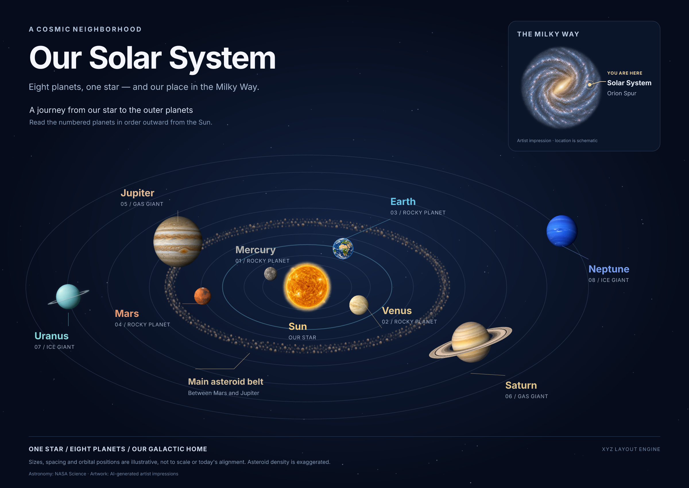

# Example: Solar System diagram with Milky Way inset

A 2400×1700 educational poster rendered with XYZ Layout Engine's shared render operations (Satori → resvg, and Playwright/Chromium), using eleven transparent illustrations generated with OpenAI `gpt-image-2.5-flare` through the HiQS resolve-image skill.



Sizes, distances, belt density and positions are schematic, not to scale. The artwork is illustrative, not observational imagery.

## What is here

| File | What it is |
|---|---|
| `solar-system.png` | Final Satori → resvg render |
| `solar-system-chromium.png` | Same scene rendered by Playwright/Chromium |
| `solar-system.html` | Self-contained responsive viewer (images inlined) |
| `contact-sheet.png` | All generated assets side by side |
| `fixture.json` | Scene content: planets, labels, layout, disclaimer, sources |
| `render-diagram.mjs` | Thin shared CLI caller; publishes a new immutable run |
| `contact-sheet.mjs` | Builds the contact sheet |
| `generate-assets.py` | Generates the illustrations through the hiqs-chain caller |
| `assets/prompts.json` | The exact prompts sent |
| `assets/*.result.json` | Per-asset generation receipts (model, recipe, alpha check, digest) |
| `assets/web/*.png` | Downscaled copies of the generated illustrations |
| `provenance.json` | Per-asset model, recipe, transparency verdict and sha256 of the original |
| `verification.json` | Render evidence: image nodes, text ids, Satori bounds, Chromium text metrics, artifact digests |
| Root `tools/` | Shared pinned fonts, request admission, trusted recipe and renderer; copied runtime removed after offline proof |

## Reproducing

Run from the repository root after `pnpm install --frozen-lockfile`:

```sh
# Render the diagram and contact sheet
node examples/2026-10-08-solar-system/render-diagram.mjs
node examples/2026-10-08-solar-system/contact-sheet.mjs

# Explicit browser render or vector export:
node examples/2026-10-08-solar-system/render-diagram.mjs --backend playwright
node examples/2026-10-08-solar-system/render-diagram.mjs --format svg

# Durable edit workflow (modifying the fixture and exporting as self-contained HTML/SVG)
mkdir -p .relay-scratch
cp examples/2026-10-08-solar-system/fixture.json .relay-scratch/solar-edit.json
node tools/render.mjs .relay-scratch/solar-edit.json --recipe solar-system --set 'planets.0.labelX=830' --save .relay-scratch/solar-edit.json --format svg --out .relay-scratch/solar-export
```

These workflows read the eleven committed `assets/web/*.png` derivatives, checking their pinned display digests and PNG/aggregate budgets. They need no full-size originals, provider credentials or paid calls. Satori is the default; Chromium runs only when explicitly requested. New artifacts use the shared atomic manifest publisher under root `tools/output/solar-system/` and `tools/output/solar-system-contact-sheet/`; resolve `manifest.json.current` to find `render.png` (or the requested export). The committed artwork and `verification.json` remain historical provenance.

The delivered recipe-owned canvases are nutrition 1000×1000 and Solar System 2400×1700, scale 1. Other dimensions and scale are explicitly rejected; arbitrary resolution/upscaling awaits suitable originals and recipe geometry. Fitting uses at most ten total native layout attempts and a 12px minimum, rejecting non-fit before publication. Text and illustrations remain separate nodes. Agent visual inspection passed for the migrated poster/contact sheet; human acceptance remains pending.

Optional asset regeneration incurs provider charges. It requires a POSIX environment, Python 3, Node, external credentials, and a matching recipe manifest. It uses only the configured deployed HiQS caller (`--caller` or `HIQS_CHAIN_CALLER`); the exact deployed caller revision is currently [Unverified].

See the root `README.md` guide for detailed recovery and dispatch expectations. In short, caller dispatches fresh/resume/changed-input calls, but refuses unknown or corrupt states rather than automatically replaying them (explicit `--force-retry` authorization is required). Generator defaults to 11 calls max, 220s per call, 900s per run, and 3 workers, with remote-unknown limitations on timeout.

**Safe dry-run testing (no paid calls) with a sufficient cap:**
```sh
mkdir -p .relay-scratch/assets-test
python3 -B examples/2026-10-08-solar-system/generate-assets.py --caller <external-entrypoint> --assets-dir .relay-scratch/assets-test --dry-run --max-calls 13
```

`--dry-run` and `--max-calls 13` do not rewrite historical prompts or receipts. (Note: The generator defaults to a cap of 11. If the planned batch exceeds the configured `--max-calls`, the generator safely refuses the batch (exit code 4) and performs zero dispatches, even in dry-run mode. A cap-zero command is a refusal control test). Exact admitted inputs include safe unique IDs, prompt/model/size/quality/background, optional `references`, flat `parameters`, `refinement_id` and `recipe_version` matching the caller manifest. Numbers must round-trip through the deployed decimal parser: unsafe integers and floats serialized in exponent form are explicitly rejected before dispatch. Existing manifest entries require a recognized status, and manifest symlinks are rejected even when dangling. References use immutable per-attempt snapshots and `--reference`; parameters use supported repeated `--param`. Caller/manifest/reference digests participate in resume identity. Solar System generation batches must include Sun admission before any remaining planets.

A nonblocking `generation.lock` covers planning through completion. Atomic manifest replacement fails closed on malformed state. Full-digest/UUID attempt directories preserve prior images and receipts, including explicit replacements. Complete/reused output requires receipt/image digests and byte size, the existing bounded PNG inspector, native decoded transparency when requested, verified caller alpha and matching recipe identity. Unknown/in-flight results and corrupt completed files return failure without automatic calls; reconcile receipts first, then explicitly authorize `--force-retry` if needed. That option can incur another paid call and preserves prior evidence.

`--max-calls` is a hard per-batch dispatch cap; `--max-workers` is 1–3. The installed caller makes exactly one paid attempt, so `--max-attempts` accepts only 1. `--timeout` bounds each local call and `--run-timeout` bounds dispatch/caller execution for the batch; timeout kills and reaps the caller process group but leaves a potentially submitted remote outcome unknown. `--max-budget` stops on cumulative recorded USD cost and serializes cost checks; it is not a guaranteed dollar ceiling when the next price is unavailable. Price/stage-metric limitations are announced before dispatch; caller-reported attempts, usage, cost and latency are retained. Live provider behavior/performance and human batch artwork acceptance remain pending. Supported generated inputs are the shared inspector's non-interlaced 8-bit RGBA PNG subset; unsupported encodings fail closed.

## Provenance

Recipe `recipe:hiqs/openai-image-generation@r2`, publication label `local_candidate` (not public admission proof). Canonical source of the image skill: HiQS AI Resolve, `skills/resolve-image/` and `skills/hiqs-chain/`. Astronomy facts and sources are listed in `fixture.json`.
