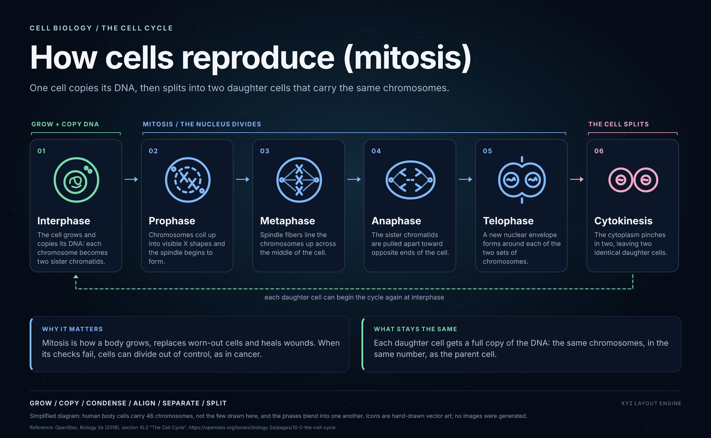

# Example: How cells reproduce (mitosis)

A 2400×1480 explainer diagram of the cell cycle, rendered with the GH-1 spike's existing render functions (Satori → resvg, and Playwright/Chromium). It is the third renderer example, after the [Solar System](../2026-10-08-solar-system/README.md) and the [RAG system](../2026-10-09-rag-system/README.md): six stage cards that read left to right, with a dashed return loop that closes the cycle.

The diagram is simplified. Human body cells carry 46 chromosomes, not the two or three drawn here, and the phases blend into one another. Four of the six stage images are hand-drawn SVG; the interphase and cytokinesis images are AI-generated (see below). No other images were generated, and nothing was uploaded.

This folder also holds the GH-8 Higgsfield transparency tests (`higgsfield-spike.py` for the REST route, `higgsfield-cli-spike.py` for the CLI route, `inspect-alpha.mjs`). **The REST route returned no alpha (0 of 12 images); the CLI route returned real alpha 4 of 4 times** with `--background transparent` and an opaque image for the control. The interphase and cytokinesis stage images are therefore AI-generated transparent PNGs (GPT Image 2.5 through the Higgsfield CLI); the other four stages are hand-drawn SVG. Evidence: [FINDINGS.md](FINDINGS.md), `spike-ledger.jsonl`, `cli-spike-ledger.jsonl`, `assets/provenance.json`. The MCP connector was not tested. Nothing keyed or matted is presented as native transparency.

## What is here

| File | What it is |
|---|---|
| `cell-division.png` | Final Satori → resvg render |
| `cell-division-chromium.png` | Same scene rendered by Playwright/Chromium |
| `cell-division.html` | Self-contained responsive viewer; double-click a label to edit it (edits are not saved) |
| `fixture.json` | Diagram copy: the six stages, the three groups and their colours, the two note panels (the credit and source lines live in the script) |
| `render-diagram.mjs` | Builds the scene, renders both backends, runs the checks, writes `verification.json` |
| `verification.json` | Evidence: image nodes, text ids, Satori bounds, Chromium text metrics, artifact digests, findings |
| `inspect-alpha.mjs` | Alpha inspector: format from magic bytes, sha256, PNG IHDR colour type and bit depth, tRNS / WebP alpha flags, and pixel alpha statistics from a Chromium canvas read |
| `FINDINGS.md` | The Phase 0 findings and verdict (NO-GO on REST; MCP untested), with the per-call table |
| `spike-ledger.jsonl` | Append-only ledger of every estimate, reservation, submit and result of the spike (scrubbed; no key, no signed URL queries) |
| `higgsfield-cli-spike.py` | Phase 0b runner for the Higgsfield CLI route: credit-capped (20), one job at a time, `selftest` (11 controls) and `run`; calls the installed `higgsfield` CLI and never touches its token |
| `cli-spike-ledger.jsonl` | Ledger of the CLI runs: baseline balance, reservations, results, alpha statistics (credits only; no account details) |
| `make-web-asset.mjs` | Makes the 256 px web copy of a generated PNG, keeping alpha |
| `assets/web/` and `assets/provenance.json` | The two committed transparent PNGs and their provenance and alpha statistics |
| `higgsfield-spike.py` | Phase 0 probe runner (Python standard library only): `selftest`, `estimate`, `submit`, `matrix [--dry-run]`, `discover`, `scan-secrets` |

## Reproducing the diagram

This example reuses the pinned runtime in the Solar System example instead of carrying a second copy.

1. `cd examples/2026-10-08-solar-system/runtime && pnpm install --frozen-lockfile`. If Chromium is missing, also run `pnpm exec playwright install chromium` there.
2. `cd ../../2026-10-09-cell-division && node render-diagram.mjs`.

A successful run prints a `PASS:` line and rewrites the PNGs, HTML and `verification.json`. It also writes `cell-division.svg`, which is not committed. Inside a macOS command sandbox, Chromium can abort at launch with `MachPortRendezvous ... Permission denied`. Run it outside the sandbox when that happens.

## What the checks prove

The script requires the six stages by name and in cycle order (interphase, prophase, metaphase, anaphase, telophase, cytokinesis). It also requires one column per stage, the three groups (grow, mitosis, split) and both note panels. It then checks both backends:

- every required icon and text id is present and unique;
- geometry is finite and positive;
- text and icons sit inside the canvas and inside their card;
- no Chromium text overflows;
- no two text boxes overlap.

These are layout checks. They do not judge whether the picture looks right or whether the biology is drawn well. The agent looked at both PNGs and adjusted the icons and spacing. The operator reviewed and approved `cell-division.png` and the `cell-division.html` viewer on 2026-10-09; that approval covers the all-SVG version published in PR #15 (commit `4d9aa2c`), not the Chromium comparison render and not any later change to the artwork.

Red controls run on 2026-10-09 on throwaway copies. Each copy was deleted afterwards, and the real files were rerun green:

- A lengthened telophase description failed `telophase_desc` in both backends: "text escapes its container", plus an overlap with `panel_same_title`.
- Removing the anaphase image node failed the one-image-per-stage assertion. The assertion diff names `asset_anaphase`.
- Moving the Chromium `subtitle` box past the right canvas edge failed `subtitle` with "text outside canvas".

## The Higgsfield spike tools

`python3 higgsfield-spike.py selftest` runs offline and must print `8/8 controls passed`. It uses dummy key files, a fake HTTP layer, and an offline guard (`HIGGSFIELD_SPIKE_OFFLINE=1`) that blocks real network calls in it and in its subprocesses. Like the render, its inspector control needs Chromium to launch, so the same sandbox note applies. The controls are:

1. A mode-644 key file is refused (exit 2, `chmod 600` hint) before its contents are read.
2. A mock 4xx body that echoes the key is recorded as `Key ***`, and the secret scan stays clean.
3. The spend gate. With $1.80 already reserved, the first $0.094 call is accepted (total $1.894, then polled, downloaded and inspected). The second is refused at $1.988 (exit 3) with no submit.
4. A second process refuses to start while the ledger lock is held (exit 5).
5. The secret scan fails on a throwaway file, and on a staged file, that holds the key ID. It passes once they are removed.
6. The inspector reports `real_alpha: true` for the Solar System web `earth.png` and `false` for the opaque `solar-system.png` poster, which is RGBA but has every alpha value at 255.
7. Estimate-route fallback. When the estimate route gives no quote (a 404, or a 200 that carries only a pricing description), a 1k/low body is reserved at the assumed $0.10 with a note and then submitted. A 2k body is refused (exit 3) with no submit. A dry run against description-only replies projects 12 × $0.10 = $1.20, with `est_source` shown per step. A paid POST that returns 404 is recorded as `absent`, and the matrix skips that endpoint's later steps.
8. Malformed quotes stop the run. `"$5.00"`, `["5.00"]`, `"NaN"`, a bare `NaN`, `"Infinity"` and `true` each stop the run with nothing reserved or submitted. A null or absent `usd` gets the assumed $0.10, `"0.094"` is accepted as an API price, and the gate refuses NaN and ±infinity.

Rules for paid runs:

- **Key file.** The path is read only from `HIGGSFIELD_KEY_FILE`, and the file must be mode 600 or 400.
- **One process at a time.** `flock` on `spike-ledger.lock` enforces this.
- **Before every submit.** The runner calls the free estimate endpoint and writes a `reserve` row to `spike-ledger.jsonl`, including the idempotency key, before the request is sent. It refuses (exit 3) if the reserved total would pass $1.90. Schema-probe fields (`background`, `output_format`) are stripped from the body that is estimated.
- **Unpriced calls.** An estimate route can give no quote: it may return 404, or a 200 with only a pricing description. In that case a 1k/low body is reserved at an assumed $0.10, recorded as `est_source: "assumed"` with a note, and any other body is refused (exit 3). A 2xx that cannot be parsed, or a 5xx, still stops the run. So does a malformed or non-finite price quote (for example `"$5.00"`, a list, `true`, `NaN` or `Infinity`): it never falls back to the assumed price. The gate refuses any total that is not a finite number. Only a 404 from the paid POST itself marks an endpoint absent. In `discover`, which only calls estimate routes, a 404 is recorded as `estimate-route-404 (generation endpoint unverified)`.

Flare and Sunburst pricing is token-based (the estimate route returns a description such as image output at $30 per 1M tokens, not a quote). The spike therefore prices each 1k/low call with an assumed $0.10 reservation. That is above the documented 1K Low figure of 1.5 credits (about $0.075 to $0.094). The ledger total is a reservation, not the bill. Higgsfield reconciles the real charge on completion, and the API cannot read it back (there is no balance endpoint), so check the console balance before and after a paid run.
- **No retries.** A timeout, network error, 5xx, or unknown poll outcome stops the whole run (exit 4) and is never retried.
- **Downloads.** Files go to `$TMPDIR/higgsfield-spike-raw`, never into the repository. The key is sent only to `https://api.higgsfield.ai`, never to result URLs, and never through redirects.
- **Scrubbing.** Every printed or ledgered string is scrubbed of the key ID, the secret and `ID:SECRET`, both raw and percent-encoded.

Run `matrix --dry-run` first: it prices every step without reserving or submitting. `scan-secrets` searches the staged diff, the staged blobs, the ledger and `FINDINGS.md`.

The paid matrix was run once on 2026-10-09: 12 paid generations, reserved at an assumed $1.20 in total (the real charge was not measured). Results and the verdict are in [FINDINGS.md](FINDINGS.md); every call is in `spike-ledger.jsonl`. Do not rerun the matrix without a new spend decision.

## Limits

- Imports the Solar System `runtime/` by relative path, so moving that folder breaks this example. GH-5 owns a shared render operation that would remove the coupling.
- Rendered and checked on macOS arm64, Node 22, with the Chromium that Playwright 1.64.0 installs. Other platforms are untested.
- `higgsfield-spike.py` tests the REST API only; `higgsfield-cli-spike.py` tests the installed CLI. The Higgsfield MCP connector is not tested here.
- The response parsing in `higgsfield-spike.py` follows the published Flare docs (`request_id`, `status_url`, `images[].url`). It also ran against the live API (12 paid calls, 2026-10-09) and the reply shapes held.
- Reference: OpenStax, *Biology 2e* (2018), section 10.2 "The Cell Cycle", https://openstax.org/books/biology-2e/pages/10-2-the-cell-cycle.
- **Review status of this version:** approved by the operator on 2026-10-09. The earlier approval covered the all-SVG render (PR #15); the operator then reviewed this version, with two AI-generated transparent cell images, and approved it too.
