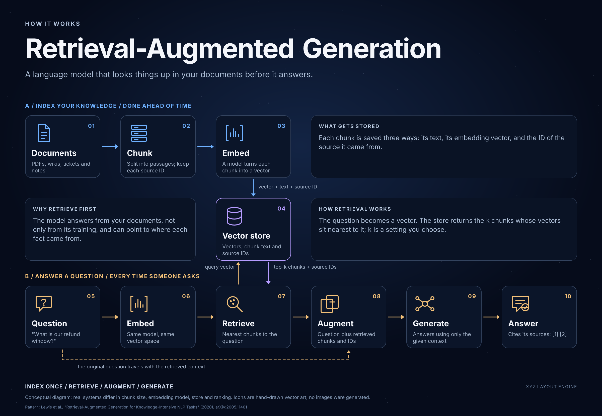

# Example: How a RAG system works

A 2400×1660 explainer diagram of retrieval-augmented generation (RAG), rendered with the GH-1 spike's existing render functions (Satori → resvg, and Playwright/Chromium). It is the second renderer example after the [Solar System](../2026-10-08-solar-system/README.md): a left-to-right pipeline with two flows instead of radial orbits.

The diagram is conceptual. Real systems differ in chunk size, embedding model, vector store and ranking. The ten stage icons are hand-drawn SVG; no images were generated and nothing was uploaded.

## What is here

| File | What it is |
|---|---|
| `rag-system.png` | Final Satori → resvg render |
| `rag-system-chromium.png` | Same scene rendered by Playwright/Chromium |
| `rag-system.html` | Self-contained responsive viewer; double-click a label to edit it (edits are not saved) |
| `fixture.json` | Diagram copy, the ten stages, lane colors and the note panels (credit and source lines live in the script) |
| `render-diagram.mjs` | Builds the scene, renders both backends, runs the checks, writes `verification.json` |
| `verification.json` | Evidence: image nodes, text ids, Satori bounds, Chromium text metrics, artifact digests, findings |

## Reproducing

This example uses the import-safe shared renderer and pinned fonts/dependencies at the repository root. Run the install command from that root.

1. `pnpm install --frozen-lockfile`. If Chromium is missing, run `pnpm exec playwright install chromium` from the repository root too.
2. `node examples/2026-10-09-rag-system/render-diagram.mjs`.

A successful run prints a `PASS:` line and rewrites the PNGs, HTML and `verification.json`. `rag-system.svg` is also written but not committed.

## What the checks prove

The script requires the six query stages, three ingest stages and the vector store by name, then checks both backends: every required icon and text id is present and unique, geometry is finite and positive, text and icons sit inside the canvas and their card, no Chromium text overflows, and no text boxes overlap. They are layout checks. They do not judge whether the picture looks right; the agent inspected both PNGs, and human review is still pending.

Red controls run on 2026-10-09, each restored afterwards: a lengthened description failed `chunk_desc` ("text escapes its container") in both backends; removing the `retrieve` icon failed the one-image-per-stage assertion; moving the Chromium `title` box past the canvas edge failed `title` ("text outside canvas").

## Limits

- Imports the root shared renderer by relative path and uses root pinned fonts/dependencies; no copied Solar runtime is required. Diagram composition/checks remain owned by this example.
- Rendered and checked on macOS arm64, Node 22, with the Chromium that Playwright 1.64.0 installs. Other platforms are untested.
- Pattern reference: Lewis et al., "Retrieval-Augmented Generation for Knowledge-Intensive NLP Tasks" (2020), https://arxiv.org/abs/2005.11401.
